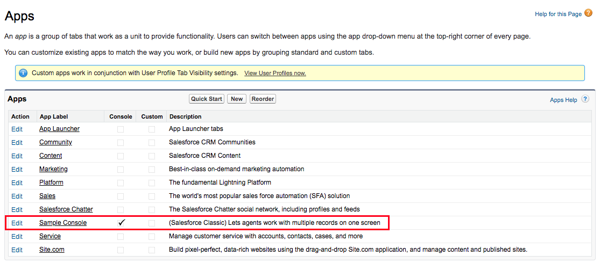

# Events in Salesforce Classic Console App
This repository contains an example component that allows Salesforce Classic users to test PureCloud for Salesforce events in a Salesforce console app.

# Table of Contents

* [Getting Started](#getting-started)
  * [TL;DR](#tldr)
  * [Prerequisites](#prerequisites)
  * [Installation](#installation)
  * [Usage](#usage)
* [Additional Information](#additional-information)

# Getting Started

## TL;DR

1. Check the version of your PureCloud for Salesforce managed package.
2. Create a Visualforce page with the example code in the repository.
3. Use the example app to test PureCloud for Salesforce events.

## Prerequisites

* Version 2.49 or later of the [PureCloud for Salesforce](https://appexchange.salesforce.com/appxListingDetail?listingId=a0N30000000pvMdEAI) managed package installed in your Salesforce organization.

## Installation

### Check the Version of the Managed Package

1. Check the version of your PureCloud for Salesforce managed package.
2. If the managed package is not version 2.49 or later, update the managed package.

### Create a Visualforce Page

1. In Salesforce, open **Developer Console**.
2. Click **File** > **New** > **Visualforce Page**.
3. Enter a name for your Apex page and click **OK**.
4. Copy the example code in the repository to this page and then save the file.

### Create a Custom Console Component

1. In Salesforce, click **Setup**.
2. Search for and click **Custom Console Components**.
3. Click **New**.
4. Add names to the **Name** and **Button Name** text boxes.
5. Under **Component**, search for and select the Visualforce page that you created.
6. Click **Save**.

### Add Your Custom Console Component

1. In Salesforce, click **Setup**.
2. Search for and click **Apps**.
3. Find the ServiceCloudConsole app. The name of this app can be unique for your Salesforce organization. In the example, the app is called Sample Console.

4. Click **Edit**. The Custom App Edit page for the ServiceCloudConsole appears.
5. Under **Choose Console Components**, move your Visualforce page from Available Items to Selected Items.
6. Click **Save**.

The custom console component now appears in the lower-left or lower-right corner of certain Service Cloud pages.

## Usage

After you complete the steps under **Installation**, click the custom console component to test Salesforce events.

* You can change the status of your user.
* You can also change the state of an active interaction with pickup, disconnect, hold, mute, or secure pause.

For more information, see [Events in Salesforce (Resource Center)](https://help.mypurecloud.com/?p=77239).

# Additional Information

This content is [licensed](LICENSE) under the MIT license.

For more information about PureCloud for Salesforce, see [About PureCloud for Salesforce (Resource Center)](https://help.mypurecloud.com/?p=65221).
