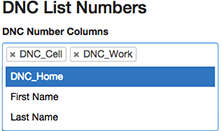
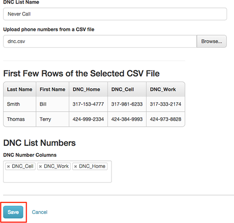
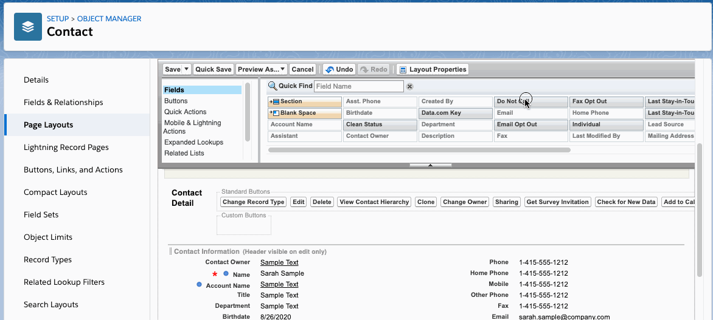

# Updating a Genesys Cloud Do-Not-Call List With the Genesys Cloud for Salesforce SDK

As a Salesforce admin, consultant or developer, you likely understand the importance of a do-not-call (DNC) list to any organization and their campaigns. The [Genesys Cloud](https://www.genesys.com/genesys-cloud) allows you to create and manage centralized DNC lists and, through the Genesys Cloud for Salesforce SDK, integrate those DNC lists with the Salesforce platform.

With the [Genesys Cloud for Salesforce SDK](https://help.mypurecloud.com/articles/sdks-in-genesys-cloud-for-salesforce/), you can easily authenticate and make RESTful requests to the Genesys Cloud Platform API using Apex code. The SDK comes bundled with the [Genesys Cloud for Salesforce integration](https://help.mypurecloud.com/articles/about-genesys-cloud-for-salesforce/), which can be installed via the [Salesforce AppExchange](https://appexchange.salesforce.com/).

This example illustrates how to use the SDK by adding the primary phone number of a Salesforce Contact to a Genesys Cloud DNC list when a **Do Not Call** field is checked on the Contact.

> **Note:** The Genesys Cloud for Salesforce integration requires a paid subscription to the Genesys Cloud.

# Table of Contents
- [Getting Started](#getting-started)
  - [Prerequisites](#prerequisites)
- [Creating a Do-Not-Call List in Genesys Cloud](#creating-a-do-not-call-list-in-genesys-cloud)
- [Creating an OAuth client in Genesys Cloud](#creating-an-oauth-client-in-genesys-cloud)
- [Installing Genesys Cloud for Salesforce](#installing-genesys-cloud-for-salesforce)
  - [Setting up a Call Center](#setting-up-a-call-center)
  - [Change the Region of Your Genesys Cloud Organization](#change-the-region-of-your-genesys-cloud-organization)
  - [Configure Call Center Settings](#configure-call-center-settings)
  - [Assign Users to the Call Center](#assign-users-to-the-call-center)
  - [Configure Country Codes](#configure-country-codes)
  - [Configuring Authentication in Salesforce](#configuring-authentication-in-salesforce)
- [Enabling the Do Not Call Field in Salesforce](#enabling-the-do-not-call-field-in-salesforce)
- [Creating the Apex Trigger and Class](#creating-the-apex-trigger-and-class)
  - [Creating the Contact Trigger in Salesforce](#creating-the-contact-trigger-in-salesforce)
  - [Creating the DoNotCallManager Class in Salesforce](#creating-the-donotcallmanager-class-in-salesforce)
  - [Calling the Genesys Cloud API](#calling-the-genesys-cloud-api)
    - [Apex Code](#apex-code)
- [Testing Your Work](#testing-your-work)
- [Additional Information](#additional-information)

## Getting Started

### Prerequisites
* A Genesys Cloud organization.
* A Salesforce organization.

## Creating a Do-Not-Call List in Genesys Cloud

Starting in your Genesys Cloud organization we'll create a DNC list. Genesys Cloud offers 3 types of DNC lists. For this example, you'll create an internal do-not-call (DNC) list.

1. Click **Admin**.
2. Under **Outbound Dialing**, click **List Management**.
3. Click the **Do Not Contact Lists** tab.
4. Click **Create New**.
5. Type a unique name in the **DNC List Name** field. DNC list names can contain spaces, numbers, and special characters, but must be unique.
6. Select a division from the **Division** box, or accept the default Home division. If the list is not assigned to a custom division, it belongs to the Home division by default.
7. Choose **Internal** from the DNC List Type box.
8. Click **Browse**. Select a .csv file. Then click **Open**. The screen displays the first few rows of data. An example .csv file has been provided in `assets/data/do-not-call.csv`.
9. From the **DNC List Numbers** box, select DNC phone number columns.
    
    
10. Click **Save**.

    

> For more detailed instructions on creating a DNC list in Genesys Cloud, see [Create a new internal DNC list](https://help.mypurecloud.com/articles/create-new-dnc-list/) documentation.

## Creating an OAuth client in Genesys Cloud

Next, we'll create an OAuth client in your Genesys Cloud organization. The OAuth client will be used to connect Salesforce and the Genesys Cloud. 

1. Click **Admin**.
2. Under **Integrations**, click **OAuth**.
3. Click **Add client**. The Client Details tab appears.
4. Set **App Name** to a descriptive name of the app. This is name shown when someone authorizes this OAuth client.
5. (Optional) Type a brief description of the app in the **Description** box.
6. Accept the default duration.
7. Make a selection below **Grant Types**. Grant Types set the way an application gets an access token. For this example, select a Client Credentials Grant.
8. Our client will need permissions to generate access tokens and add to the DNC list.
9.  Click the **Roles** tab. This opens a list of roles to choose from. Assign a minimum set of roles to determine what your OAuth client integration can do.
Note: To grant roles to an OAuth client, you must have those roles assigned to your profile.
10. Click **Save**. Genesys Cloud creates a Client ID and a Client Secret (token).

The Genesys Cloud OAuth client is now ready to use. Remember those credentials, we'll need them in Salesforce.

> For more detailed installation instructions, see [Create an OAuth client](https://help.mypurecloud.com/articles/create-an-oauth-client/) documentation.

## Installing Genesys Cloud for Salesforce

Now we're ready to move over to your SalesForce organization. As mentioned, the Genesys Cloud for Salesforce SDK comes bundled with the Genesys Cloud for Salesforce integration. To access the SDK, you must install the integration from the [Salesforce AppExchange](https://appexchange.salesforce.com/).

1. Download the managed package from the Salesforce AppExchange.
2. During the first step of the installation, click Install for All Users or Install for Specific Profiles.
3. Follow the on-screen instructions for installation.

Once installed, you should have access to the [Genesys Cloud for Salesforce SDK](https://help.mypurecloud.com/articles/use-the-sdk-to-call-the-genesys-cloud-platform-apis-in-salesforce/) which exposes GET, POST, PUT, or DELETE methods under the `purecloud.SDK.Rest` namespace in Salesforce. Before we can use these methods, we'll need to configure a few more things.

> For more detailed installation instructions, see [Install or upgrade the Genesys Cloud for Salesforce managed package](https://help.mypurecloud.com/articles/install-or-upgrade-the-genesys-cloud-for-salesforce-managed-package/) documentation.

### Setting up a Call Center

To use the Genesys Cloud for Salesforce integration, we'll set up a call center in Salesforce and configure Client Settings in the managed package settings. Then assign users to that call center.

> Note: Salesforce users cannot use call center features until you have assigned the users to a call center.

### Change the Region of Your Genesys Cloud Organization

1. In Salesforce, click **Setup**.
2. Search for **Call Centers**.
3. Under **Feature Settings** > **Service** > **Call Center**, click **Call Centers**.
4. Click **Continue**. The All Call Centers page appears, which lists all current call center records.
5. Click **Edit** next to PureCloud for Salesforce or PureCloud for Salesforce Lightning.
6. Modify the domain that appears for **CTI Adapter URL** based on the location of your Genesys Cloud organization.

    In this example, we'll use `apps.mypurecloud.com`. You can see a full list of domains here under **PureCloud for Salesforce**: [Change the region of your Genesys Cloud organization](https://help.mypurecloud.com/articles/change-the-region-of-your-genesys-cloud-organization/).

7. Click **Save**.

> For more detailed instructions on changing the region of your Genesys Cloud organization, see [Set up a call center in Salesforce](https://help.mypurecloud.com/articles/set-up-a-call-center-in-salesforce/) documentation.

### Configure Call Center Settings

1. Click **Setup**.
2. Search for **Installed Packages**.
3. Under **Apps** > **Packaging**, click **Installed Packages**.
4. On the **Installed Packages** page, click **Configure** next to the PureCloud for Salesforce package.
5. Under **Choose a Call Center**, select a version of the call center definition. The managed package that you installed contains two different call center definition files: one for Salesforce Classic (PureCloud for Salesforce) and one for Lightning Experience (PureCloud for Salesforce Lightning).
6. Under **Settings**, configure the following items:
   - **Auto Redirect to SSO** should be checked.
   - Set **SSO Identity Provider** Name to `Salesforce`.
   - Set **PureCloud Organization Name** to `Genesys`.
7. Click **Save**.

> For more detailed installation instructions, see [Configure call center settings](https://help.mypurecloud.com/articles/configure-call-center-settings/) documentation.

### Assign Users to the Call Center

Though not needed for this particular example, you will need to assign users to the call center before it can be used.

> For more detailed instructions on assigning users to a call center, see [Set up a call center in Salesforce](https://help.mypurecloud.com/articles/set-up-a-call-center-in-salesforce/) documentation.

### Configure Country Codes

1. Click **Setup**.
2. Search for **Installed Packages**.
3. Under **Apps** > **Packaging**, click **Installed Packages**.
4. On the **Installed Packages** page, click **Configure** next to the PureCloud for Salesforce package.
5. Under **Choose a Call Center**, select a version of the call center definition.
6. Under Country Code Settings, configure Screen Pop Country Codes and Default Outbound SMS Country Code. We'll set our **Default Outbound SMS Country Code** to `United States +1`.

> For more detailed instructions on configuring country codes, see [Configure country codes](https://help.mypurecloud.com/articles/configure-country-codes/) documentation.

### Configuring Authentication in Salesforce

1. Click **Setup**.
2. Search for **Installed Packages**.
3. Under **Apps** > **Packaging**, click **Installed Packages**.
4. On the **Installed Packages** page, click **Configure** next to the PureCloud for Salesforce package.
5. Click **Shared Settings**.
6. In the **Authentication** section, click **Modify**.
7. Enter the **Client ID** and **Client Secret** from your OAuth client you created in Genesys Cloud.
8. Click **Save**.
9. Select the **Region** of your Genesys Cloud organization.

   If you change **Region**, click **Save**.

10. Click **Test**.

> For more detailed instructions on configuring authentication in Salesforce, see [Configure authentication](https://help.mypurecloud.com/articles/configure-authentication/) documentation.

## Enabling the Do Not Call Field in Salesforce

1. Click **Setup**.
2. Click **Object Manager** (not the menu arrow) to get a list of Salesforce objects.
3. In the **Quick Find**, type "Contact" to filter the list.
4. Click the **Contact** object.
5. Click **Fields & Relationships** from the menu on the left-hand side.
6. Find **Do Not Call** and click it.
7. Click the **Set Field-Level Security** button.
8. Under the **Visible** column, select the security profiles for which you'd like to show the field.
9. Click the **Save** button.
10. Next, click on **Page Layouts** in the left-hand menu.
11. To add the checkbox to all layouts, we'll click the page layout named **Contact Layout**.
12. Scroll down to the **Contact Information** section and drag the **Do Not Call** button down into the that section.



You should now see a checkbox labeled **Do Not Call** when creating and editing Contacts in Salesforce.

## Creating the Apex Trigger and Class

In this example, we'll use an Apex Trigger and an [Apex Class](https://developer.salesforce.com/docs/atlas.en-us.apexcode.meta/apexcode/apex_classes_understanding.htm) to capture the click of a checkbox and call the Genesys Cloud Platform API. If the **Do Not Call** field is checked on an insert or update, the Trigger code calls to a custom class that connects to the Genesys Cloud Platform API and adds the Contact's phone number. Since we're making an asynchronous call to the Genesys Cloud Platform API, the class method will need a [Future Annotation](https://developer.salesforce.com/docs/atlas.en-us.apexcode.meta/apexcode/apex_classes_annotation_future.htm?search_text=@future) to designate it as an asynchronous callout.

### Creating the Contact Trigger in Salesforce

1. In the Developer Console, click **File** > **New** > **Apex Trigger**.
2. Enter `ContactTrigger` for the trigger name, and then select **Contact** for the sObject.
3. Replace the default code with the code found in `src/triggers/ContactTrigger.trigger`.
4. To save, press **Ctrl+S**.

We'll be making use of the `isUpdate`, `isInsert`, `isBefore` and `isAfter` Context Variables available to Apex triggers in our Salesforce Class.

### Creating the DoNotCallManager Class in Salesforce

1. In the Developer Console, click **File** > **New** > **Apex Class**.
2. Enter `DoNotCallManager` for the class name, and then click **OK**.
3. Replace the default code with the code found in `src/classes/DoNotCallManager.cls`.
4. To save, press **Ctrl+S**.

### Calling the Genesys Cloud API

The heart of the code that calls the Platform API is in `addPhoneNumber`. Here we're calling an endpoint in the [Outbound API Resource](https://developer.mypurecloud.com/api/rest/v2/outbound/#post-api-v2-outbound-conversations--conversationId--dnc) using the SDK. This endpoint adds a phone number to a DNC list via a POST request to `/api/v2/outbound/conversations/{conversationId}/dnc`. This endpoint takes a serialized array of phone numbers and requires a user with the `outbound:dnc:add` permissions and an `outbound` scope.

#### Apex Code

```java
String payload = JSON.serialize(new List<String>{ phoneNumber });

HttpResponse response = purecloud.SDK.Rest.post(
'/api/v2/outbound/conversations/{conversationId}/dnc', payload );
```

## Testing Your Work

Once everything is in place, you should be able to create a new contact via the Salesforce UI and check the **Do Not Call** checkbox.

After saving the contact, log into your Genesys Cloud account and export your DNC list. You should see the phone number of your new contact in the exported CSV.

1. Click **Admin**.
2. In the Search bar, type "Outbound".
3. Select **Outbound Settings**.
4. Select **List Management** from the left-hand menu.
5. Select **Do Not Contact List** from the top tabs.
6. Find the `SalesforceTest` list we created earlier and click the list's Name.
7. Click **Export** at the bottom of the page and open the CSV to confirm the phone number was added.

## Additional Information

This content is [licensed](/LICENSE) under the MIT license.

For more information about Genesys Cloud for Salesforce, see [About Genesys Cloud for Salesforce (Resource Center)](https://help.mypurecloud.com/?p=65221).
